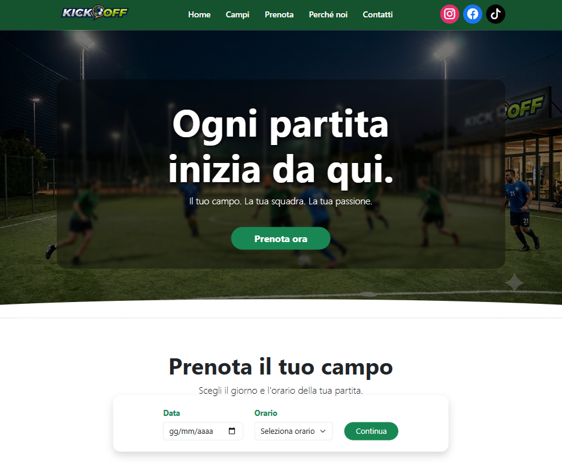
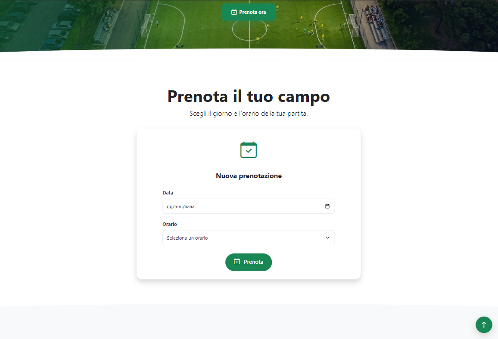
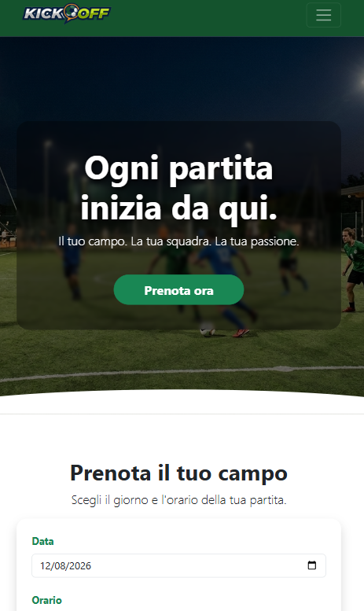

# ⚽ KickOff - Football Booking System

Applicazione web full-stack per la gestione e prenotazione di campi da calcio.

Il progetto permette agli utenti di selezionare una data e un orario, verificare la disponibilità dei campi e completare una prenotazione tramite un'interfaccia web semplice, moderna e responsive.

## 📸 Anteprima

### Homepage



### Prenotazione



### Responsive



## 🚀 Tecnologie utilizzate

### Backend

- Java
- Spring Boot
- Spring Data JPA
- Hibernate
- PostgreSQL
- REST API
- Swagger / OpenAPI

### Frontend

- Angular
- TypeScript
- Bootstrap
- Bootstrap Icons
- HTML5
- CSS3

## 🗄️ Database

Il progetto utilizza **PostgreSQL** come database relazionale per la gestione dei dati relativi ai **campi da calcio** e alle **prenotazioni**.

Il database gestisce:

- Informazioni e disponibilità dei campi
- Dati del cliente associati alla prenotazione
- Data e orario della partita
- Stato della prenotazione (`CONFIRMED` / `CANCELLED`)
- Prezzo della prenotazione

L'accesso ai dati viene gestito tramite **Spring Data JPA** e **Hibernate**, utilizzando repository JPA per le operazioni di persistenza.

## 🛠️ Strumenti e supporto allo sviluppo

- IntelliJ IDEA
- Visual Studio Code
- Postman
- Git / GitHub
- GitHub Desktop
- ChatGPT come supporto allo sviluppo, debugging e revisione del codice

## ⚽ Funzionalità principali

- Selezione della data della partita
- Selezione dell'orario disponibile
- Verifica della disponibilità dei campi
- Prenotazione di una partita
- Validazione dei dati inseriti
- Controllo delle prenotazioni già effettuate
- Prevenzione di prenotazioni multiple dello stesso numero di telefono nella stessa fascia oraria
- Gestione dello stato della prenotazione:
  - `CONFIRMED`
  - `CANCELLED`
- Visualizzazione della conferma della prenotazione
- Gestione degli errori e delle prenotazioni non disponibili
- Interfaccia responsive per desktop, tablet e smartphone

## 🗂️ Struttura del progetto

```text
KickOff/
│
├── backend/
│   └── src/
│       └── main/
│           └── java/
│
├── frontend/
│   └── src/
│       ├── app/
│       └── assets/
│
└── README.md
```

## 🔧 Backend

Il backend è sviluppato con **Spring Boot** e utilizza **PostgreSQL** come database.

Le principali operazioni vengono esposte tramite API REST per:

- Creare una prenotazione
- Recuperare tutte le prenotazioni
- Recuperare le prenotazioni di un determinato campo
- Annullare una prenotazione
- Recuperare i campi disponibili

### Endpoint principali

| Metodo | Endpoint                            | Descrizione                          |
| ------ | ----------------------------------- | ------------------------------------ |
| POST   | `/api/reservations`                 | Crea una prenotazione                |
| GET    | `/api/reservations`                 | Recupera tutte le prenotazioni       |
| GET    | `/api/reservations/field/{fieldId}` | Recupera le prenotazioni di un campo |
| DELETE | `/api/reservations/{id}`            | Annulla una prenotazione             |
| GET    | `/api/fields`                       | Recupera i campi disponibili         |

## 🎨 Frontend

Il frontend è sviluppato con **Angular** e utilizza componenti standalone.

L'interfaccia comprende:

- Navbar
- Hero section
- Sezione prenotazione
- Form di prenotazione
- Sezione servizi
- Video promozionale
- Vantaggi di KickOff
- Statistiche
- Sezione contatti
- Footer

Il layout è responsive grazie a **Bootstrap**.

## 📅 Regole di prenotazione

Le prenotazioni rispettano alcune regole definite nel backend:

- Le prenotazioni sono disponibili dalle **16:00 alle 23:00**
- Gli orari devono essere selezionati su un'ora intera
- Ogni prenotazione ha una durata di **1 ora**
- Lo stesso numero di telefono non può effettuare più prenotazioni nella stessa fascia oraria
- Non è possibile prenotare una data passata
- Il campo deve essere disponibile per la data e l'orario selezionati

## 💰 Prezzo

Il prezzo della prenotazione viene impostato dal backend a:

**50 € per partita**

## 🚀 Sviluppi futuri

- Registrazione, login e autenticazione utenti
- Gestione ruoli: `CLIENT`, `RECEPTIONIST`, `ADMIN`
- Pannelli dedicati a receptionist e amministratore
- Gestione avanzata di utenti, campi e prenotazioni
- Calendario e notifiche email
- Pagamenti online
- Spring Security e gestione delle autorizzazioni

## ▶️ Avvio del progetto

### Backend

Configurare PostgreSQL e inserire le credenziali del database nel file di configurazione del backend.

Successivamente avviare l'applicazione Spring Boot.

Il backend sarà disponibile all'indirizzo:

```text
http://localhost:8080
```

### Frontend

Entrare nella cartella `frontend` e installare le dipendenze:

```bash
npm install
```

Avviare l'applicazione Angular:

```bash
ng serve
```

Il frontend sarà disponibile all'indirizzo:

```text
http://localhost:4200
```

## 📖 API Documentation

Le API REST sono documentate tramite **Swagger / OpenAPI**.

Durante l'esecuzione del backend è possibile utilizzare Swagger UI per visualizzare e testare gli endpoint disponibili.

## 👨‍💻 Autore

**Francesco Pio Cataudo**

Progetto realizzato come applicazione full-stack per la gestione delle prenotazioni di campi da calcio.

## 📄 License

This project is licensed under the MIT License.

