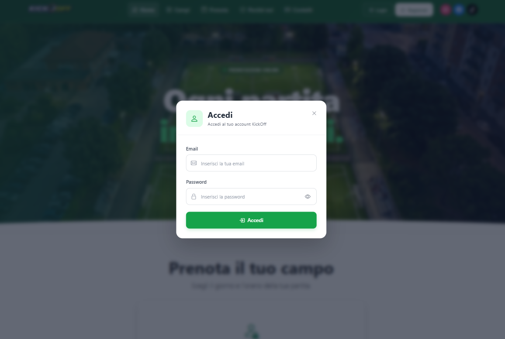
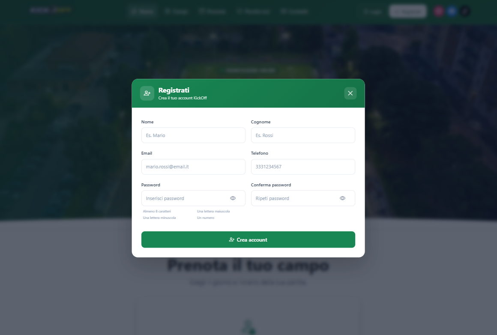
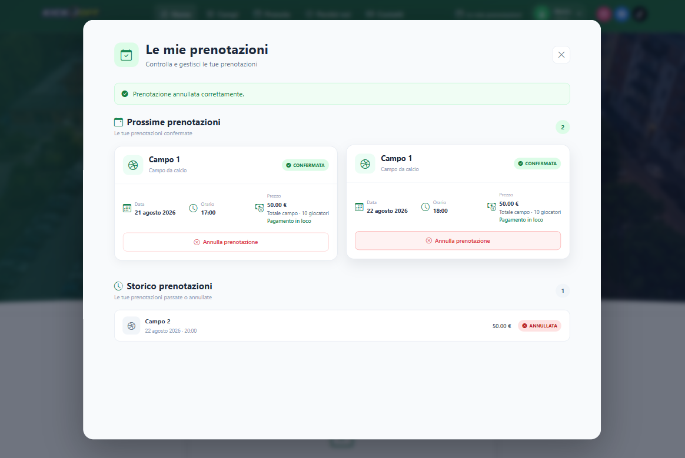
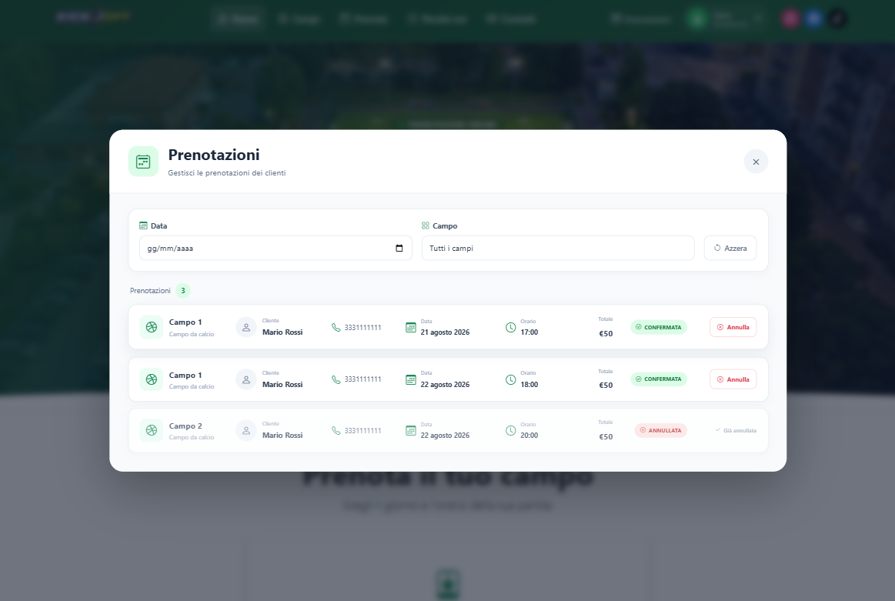
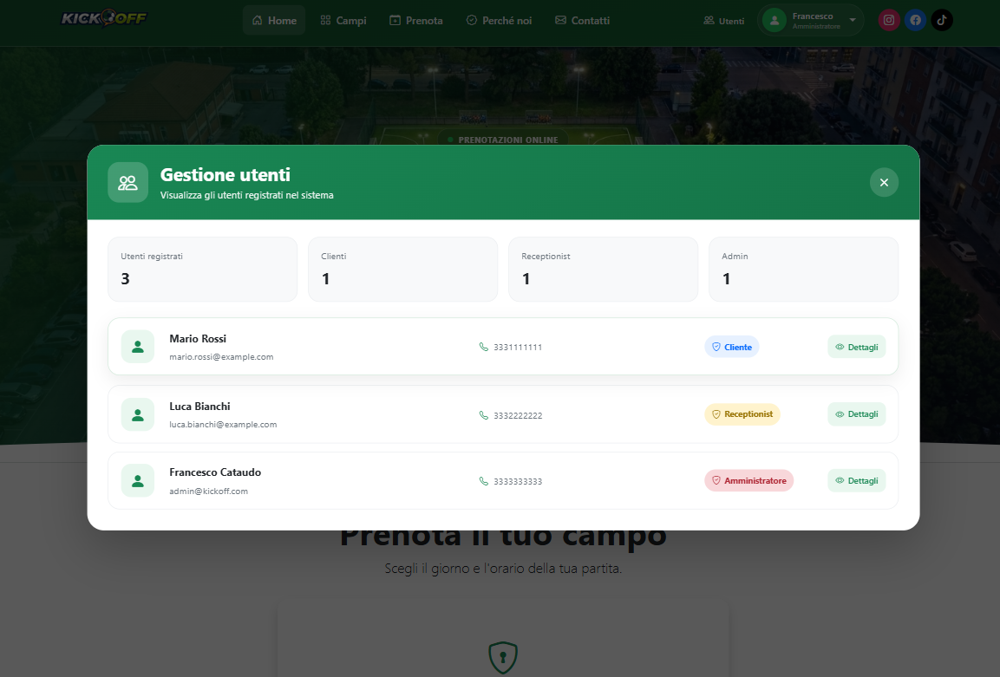

# ⚽ KickOff - Football Booking System

Applicazione web full-stack per la gestione e prenotazione di campi da calcio.

KickOff permette agli utenti di registrarsi, autenticarsi, e gestire le proprie prenotazioni attraverso un'interfaccia web responsive.

Il sistema prevede inoltre una gestione degli accessi basata sui ruoli, con funzionalità differenti per CLIENTE, RECEPTIONIST e ADMIN.

---

## 📸 Anteprima

### Homepage


### Login



### Registrazione



### Prenotazione


### Le mie prenotazioni



### Gestione prenotazioni RECEPTIONIST



### Visualizzazione utenti



---

## 🚀 Tecnologie utilizzate

### Backend

- Java
- Spring Boot
- Spring Data JPA
- Hibernate
- PostgreSQL
- Spring Security
- JWT
- REST API
- Swagger / OpenAPI
- JUnit
- Mockito

### Frontend

- Angular
- TypeScript
- Bootstrap
- Bootstrap Icons
- HTML5
- CSS3

---

## 🛠️ Strumenti e supporto allo sviluppo

- IntelliJ IDEA
- Visual Studio Code
- Postman
- Git / GitHub
- GitHub Desktop
- ChatGPT come supporto allo sviluppo, debugging e revisione del codice

---

## 🏗️ Architettura

Il progetto segue un'architettura a livelli, separando le principali responsabilità dell'applicazione:

Controller
    ↓
Service
    ↓
Repository
    ↓
Database

Sono inoltre presenti:

- DTO per lo scambio dei dati
- Mapper per la conversione Entity/DTO
- Repository JPA
- gestione centralizzata delle eccezioni
- autenticazione JWT
- autorizzazione tramite ruoli
- Seeder per l'ambiente di sviluppo
- test unitari e test dei controller

---

## 🗄️ Database

Il progetto utilizza **PostgreSQL** come database relazionale.

Il database gestisce principalmente:

- Utenti
- Ruoli degli utenti
- Campi da calcio
- Prenotazioni
- Stato delle prenotazioni
- Data e orario della partita
- Prezzo della prenotazione

L'accesso ai dati viene gestito tramite Spring Data JPA e Hibernate.

---

## 🔐 Autenticazione e sicurezza

Il backend utilizza **Spring Security** e **JWT (JSON Web Token)** per gestire autenticazione e autorizzazione.

Dopo il login, il server restituisce un token JWT che viene utilizzato per autenticare le richieste successive.

Il token viene verificato tramite un filtro personalizzato:

```text
JwtAuthenticationFilter
```

Il sistema utilizza inoltre ruoli applicativi:
  - `CLIENTE`
  - `RECEPTIONIST`
  - `ADMIN`

Le autorizzazioni vengono gestite tramite `SecurityConfig`.

### Esempio di autorizzazione

| Ruolo | Funzionalità principali |
|---|---|
| CLIENTE | Registrazione, login, prenotazione e gestione delle proprie prenotazioni |
| RECEPTIONIST | Visualizzazione e gestione delle prenotazioni |
| ADMIN | Visualizzazione degli utenti |

Le password degli utenti vengono salvate utilizzando **BCrypt** tramite `PasswordEncoder`.

---

## ⚽ Funzionalità principali

### Utenti

- Registrazione di un nuovo utente
- Login
- Autenticazione tramite JWT
- Recupero del profilo dell'utente autenticato
- Visualizzazione degli utenti da parte dell'ADMIN
- Gestione dei ruoli

### Prenotazioni

- Selezione della data
- Selezione dell'orario
- Verifica della disponibilità dei campi
- Creazione di una prenotazione
- Visualizzazione delle proprie prenotazioni
- Visualizzazione delle prenotazioni da parte del RECEPTIONIST
- Cancellazione della propria prenotazione
- Annullamento delle prenotazioni da parte del RECEPTIONIST
- Gestione dello stato `CONFIRMED` / `CANCELLED`
- Gestione degli errori e dei conflitti di prenotazione

### Campi da calcio

- Visualizzazione dei campi

---

## 📡 Endpoint principali

### Authentication

| Metodo | Endpoint | Descrizione |
|---|---|---|
| POST | `/api/auth/login` | Effettua il login |
| GET | `/api/auth/me` | Recupera l'utente autenticato |

### Users

| Metodo | Endpoint | Descrizione |
|---|---|---|
| POST | `/api/users` | Registra un nuovo utente |
| GET | `/api/users` | Recupera tutti gli utenti |
| GET | `/api/users/{id}` | Recupera un utente |
| DELETE | `/api/users/{id}` | Elimina un utente |

### Reservations

| Metodo | Endpoint | Descrizione |
|---|---|---|
| POST | `/api/reservations` | Crea una prenotazione |
| GET | `/api/reservations` | Recupera tutte le prenotazioni |
| GET | `/api/reservations/my` | Recupera le proprie prenotazioni |
| GET | `/api/reservations/field/{fieldId}` | Recupera le prenotazioni di un campo |
| DELETE | `/api/reservations/{id}` | Cancella una propria prenotazione |
| PATCH | `/api/reservations/{id}/cancel` | Annulla una prenotazione come RECEPTIONIST |

### Football Fields

| Metodo | Endpoint | Descrizione |
|---|---|---|
| GET | `/api/fields` | Recupera i campi |
| GET | `/api/fields/{id}` | Recupera un campo |
| POST | `/api/fields` | Crea un campo |
| PUT | `/api/fields/{id}` | Modifica un campo |

---

## 📅 Regole di prenotazione

Le prenotazioni vengono validate direttamente dal backend.

Le principali regole sono:

- Le prenotazioni sono disponibili dalle **16:00 alle 23:00**
- Gli orari devono essere selezionati su un'ora intera
- Ogni prenotazione ha una durata di **1 ora**
- Non è possibile prenotare una data passata
- Il campo deve essere disponibile per la data e l'orario selezionati
- Un utente non può effettuare più prenotazioni nella stessa fascia oraria
- Una prenotazione già confermata genera un conflitto (`409 Conflict`)
- Una prenotazione cancellata non viene considerata una prenotazione attiva

---

## 💰 Prezzo

Il prezzo della prenotazione viene impostato direttamente dal backend:

**50 € per partita**

Il prezzo non viene determinato dal frontend, evitando che il client possa modificarne arbitrariamente il valore.

---

## 🧪 Testing

Il progetto include una suite di test realizzata con **JUnit e Mockito**.

Sono presenti test per:

### Controller

- `AuthControllerTest`
- `UserControllerTest`
- `FootballFieldControllerTest`
- `ReservationControllerTest`

### Service

- `AuthServiceImplTest`
- `UserServiceImplTest`
- `FootballFieldServiceTest`
- `ReservationServiceImplTest`
- `JwtServiceTest`

I test verificano, tra le altre cose:

- comportamento degli endpoint
- status HTTP
- JSON restituiti
- chiamate ai service
- validazione dei DTO
- gestione delle prenotazioni
- autenticazione JWT
- regole di business
- gestione degli errori

---

## 🌱 Seeder

Per l'ambiente di sviluppo sono presenti dei Seeder che permettono di inizializzare automaticamente il database con dati di esempio.

Sono presenti Seeder per:

- Campi da calcio
- Utenti
- Prenotazioni

I Seeder vengono eseguiti solamente con il profilo:

```text
dev
```

e verificano la presenza di dati esistenti prima di procedere all'inserimento.

---

## 🎨 Frontend

Il frontend è sviluppato con **Angular** utilizzando componenti standalone.

L'interfaccia comprende:

- Navbar
- Homepage
- Hero section
- Login
- Registrazione
- Profilo utente
- Prenotazione
- Le mie prenotazioni
- Gestione prenotazioni RECEPTIONIST
- Gestione utenti ADMIN
- Sezione servizi
- Video promozionale
- Statistiche
- Sezione contatti
- Footer

Il layout è responsive grazie a **Bootstrap**.

Il frontend utilizza inoltre un **HTTP interceptor** per gestire automaticamente l'invio del token JWT nelle richieste protette.

---

## 🗂️ Struttura del progetto

```text
KickOff/
│
├── backend/
│   ├── src/
│   │   ├── main/
│   │   │   ├── java/
│   │   │   │   └── com/fpc/football_booking/
│   │   │   │       ├── config/
│   │   │   │       ├── controller/
│   │   │   │       ├── dto/
│   │   │   │       ├── entity/
│   │   │   │       ├── exception/
│   │   │   │       ├── mapper/
│   │   │   │       ├── repository/
│   │   │   │       ├── seeder/
│   │   │   │       └── service/
│   │   │   │           └── impl/
│   │   │   └── resources/
│   │   │
│   │   └── test/
│   │       └── java/
│   │
│   └── pom.xml
│
├── frontend/
│   ├── src/
│   │   ├── app/
│   │   └── assets/
│   └── package.json
│
└── README.md
```

## 🔧 Backend

Il backend è sviluppato con **Spring Boot** e utilizza PostgreSQL.

Le API REST sono organizzate tramite controller dedicati:

- `AuthController`
- `UserController`
- `ReservationController`
- `FootballFieldController`

La logica applicativa è separata nei relativi service e implementazioni.

La persistenza viene gestita tramite repository JPA.

La conversione tra Entity e DTO viene effettuata tramite mapper dedicati.

---

## ▶️ Avvio del progetto

### Backend

Configurare PostgreSQL e impostare le proprietà necessarie nel file di configurazione locale.

Per l'ambiente di sviluppo utilizzare il profilo:

```text
dev
```
Successivamente avviare l'applicazione Spring Boot.

Il backend sarà disponibile all'indirizzo:

```text
http://localhost:8080
```

###Frontend

Entrare nella cartella `frontend`:

```text
cd frontend
```

Installare le dipendenze:

```text
npm install
```

Avviare Angular:

```text
ng serve
```

Il frontend sarà disponibile all'indirizzo:

```text
http://localhost:4200
```

---

## ⚙️ Configurazione

Prima di avviare il backend è necessario configurare PostgreSQL e creare il database:

```text
fpc_football_booking
```
Le configurazioni contenenti credenziali, password e chiavi JWT non vengono incluse nel repository.

Per l'ambiente di sviluppo, creare localmente il file:

```text
backend/src/main/resources/application-dev.properties
```

utilizzando come riferimento:

```text
backend/src/main/resources/application-dev.properties.example
```

Il file locale deve contenere le proprie configurazioni, ad esempio:

```text
spring.datasource.url=jdbc:postgresql://localhost:5432/fpc_football_booking
spring.datasource.username=postgres
spring.datasource.password=${DB_PASSWORD}

spring.jpa.hibernate.ddl-auto=create
spring.jpa.show-sql=false

jwt.secret=LA_TUA_JWT_SECRET
jwt.expiration=3600000
```

La password del database viene letta dalla variabile d'ambiente:

```text
DB_PASSWORD
```

La chiave `jwt.secret` deve essere sostituita con una propria chiave segreta JWT.

Il file `application-dev.properties` è escluso dal repository tramite `.gitignore`.

Per avviare il backend utilizzando il profilo `dev`:

```text
spring.profiles.active=dev
```

oppure configurare il profilo direttamente tramite IntelliJ IDEA.


---

## 📖 API Documentation

Le API REST sono documentate tramite Swagger / OpenAPI.

Durante l'esecuzione del backend è possibile utilizzare Swagger UI per visualizzare e testare gli endpoint disponibili.

```text
http://localhost:8080/swagger-ui/index.html
```
---

## 🚀 Sviluppi futuri

Possibili evoluzioni del progetto:

- Gestione dei campi da parte del **RECEPTIONIST**
- Gestione delle informazioni degli utenti da parte del **RECEPTIONIST**
- Gestione dei **RECEPTIONIST** da parte dell'**ADMIN**
- Notifiche email per le prenotazioni
  
---

## 👨‍💻 Autore

**Francesco Pio Cataudo**

Progetto full-stack per la prenotazione di campi da calcio.

---

## 📄 License

This project is licensed under the MIT License.
